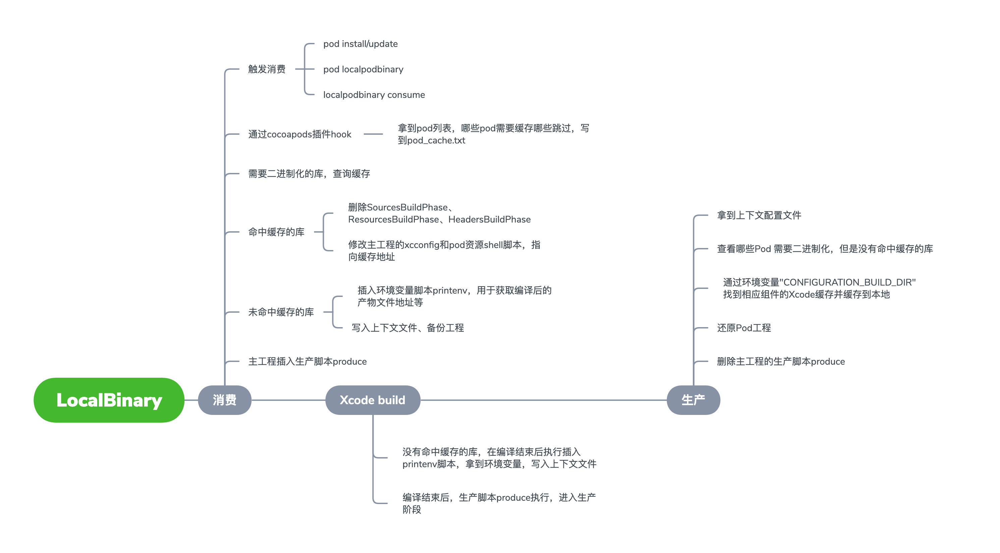
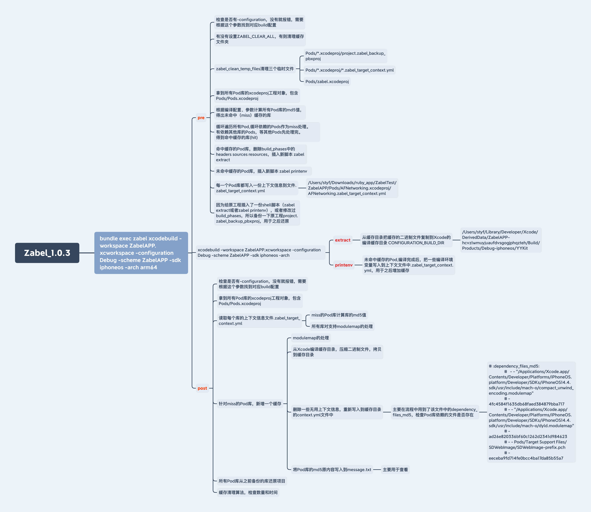

# cocoapods-localpodbinary

Xcode版本地二进制缓存ruby库。

一句话原理：Xcode编译结束后，把编译产物缓存下来。使用时，修改主工程的xcconfig指向缓存目录。

参考：

[网易新闻iOS工程组件化实践](https://mp.weixin.qq.com/s?__biz=MzUxODg0MzU2OQ==&mid=2247490694&idx=1&sn=17eccff062d5ce7d50ea03f508810bc5&scene=21#wechat_redirect)

[iOS Pod 构建缓存方案](https://mp.weixin.qq.com/s?__biz=MzU0MTk2OTc2Mw==&mid=2247483664&idx=1&sn=e34cb5923907e4089782d3c16147f63f&chksm=fb209d1ccc57140afc5793b00d980f8d3632a3b3ec27b83d63050a0b7a35626c0026321edcae&scene=21#wechat_redirect)

[iOSer 开始学习 Bazel 了？](https://mp.weixin.qq.com/s/P2qvCsPQ5mPcANp1HboMCQ)

## Installation

    确认本机有安装bundler以及ruby环境
    
    git clone 插件，放入项目目录下
    
    修改Gemfile文件
    gem "cocoapods-localpodbinary",:path => './cocoapods-localpodbinary'
    执行 bundle install 安装插件
    
    希望在pod install/update时也执行消费操作的，在podfile文件中引入插件：
    plugin 'cocoapods-localpodbinary'

## Usage

    1.如果有需要不想被缓存的库，可修改podfile对应库配置。默认全部缓存
    pod 'AFNetworking', '~> 4.0.0', :cache_type => false
    
    2.执行消费命令
    pod localpodbinary
    或者
    bundle exec localpodbinary consume
    有在podfile引入插件的，执行完pod install/update后会自动执行消费命令
    
    3.打开xcode进行编译，编译结束后会自动执行生产命令

